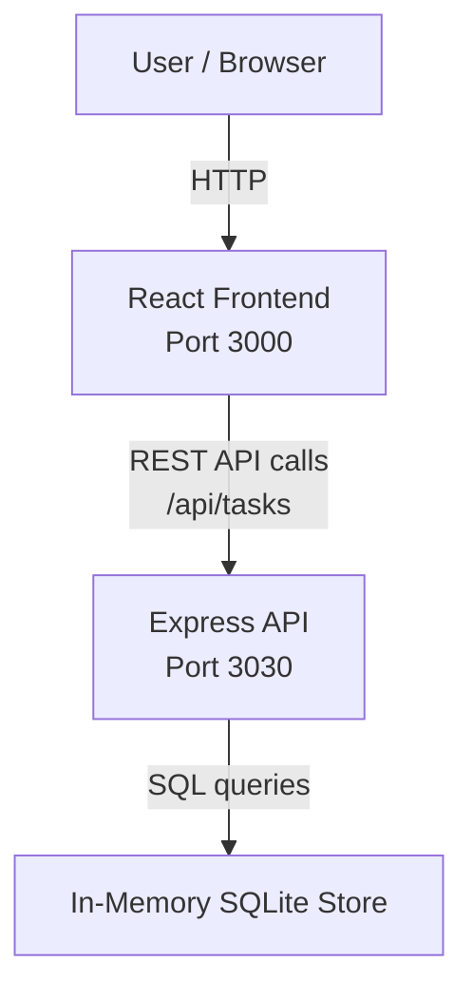
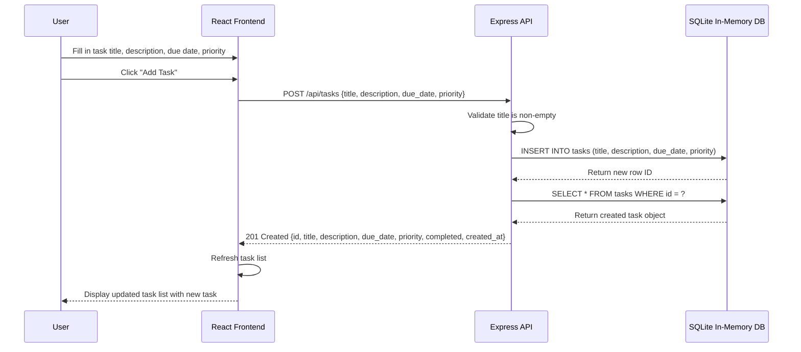

# Cloud Architecture Overview

## System Context Diagram

```mermaid
graph TD
    User[User / Browser]
    Frontend[React Frontend<br/>Port 3000]
    Backend[Express API<br/>Port 3030]
    DB[In-Memory SQLite Store]

    User -->|HTTP| Frontend
    Frontend -->|REST API calls<br/>/api/tasks| Backend
    Backend -->|SQL queries| DB
```

## Sequence Diagram: Creating a TODO

```mermaid
sequenceDiagram
    participant User
    participant Frontend as React Frontend
    participant Backend as Express API
    participant DB as SQLite In-Memory DB

    User->>Frontend: Fill in task title, description, due date, priority
    User->>Frontend: Click "Add Task"
    Frontend->>Backend: POST /api/tasks {title, description, due_date, priority}
    Backend->>Backend: Validate title is non-empty
    Backend->>DB: INSERT INTO tasks (title, description, due_date, priority)
    DB-->>Backend: Return new row ID
    Backend->>DB: SELECT * FROM tasks WHERE id = ?
    DB-->>Backend: Return created task object
    Backend-->>Frontend: 201 Created {id, title, description, due_date, priority, completed, created_at}
    Frontend->>Frontend: Refresh task list
    Frontend-->>User: Display updated task list with new task
```
